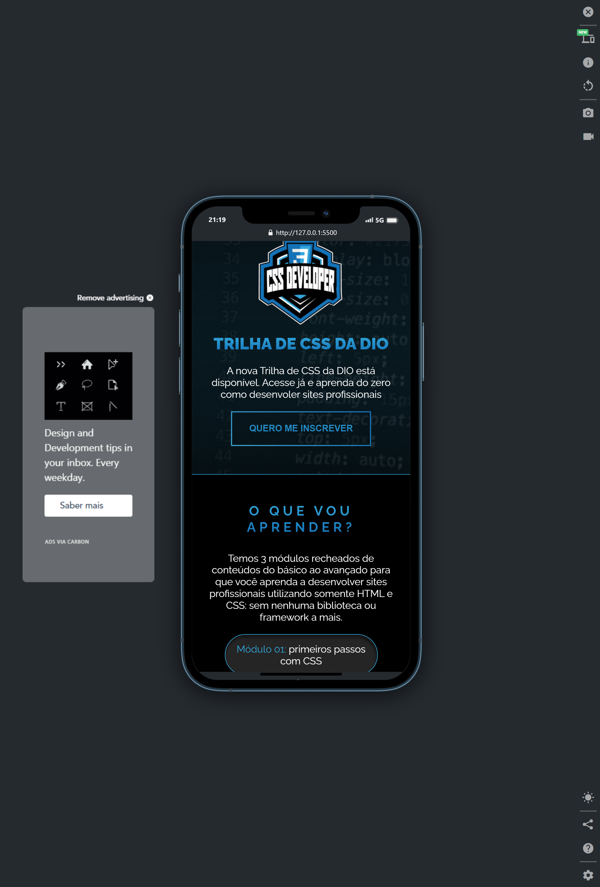

# desafiodaDIO-CSS
Desafio de CSS oferecido pelo curso de CSS da DIO.me
<h1 align="center"> DesafioDeInverno </h1>

Este foi um desafio proposto pelo curso de CSS da <a href="https://www.dio.me/">DIO.me </a>!

 

  <a href="#-tecnologias">Tecnologias</a>&nbsp;&nbsp;&nbsp;|&nbsp;&nbsp;&nbsp;
  <a href="#-projeto">Projeto</a>&nbsp;&nbsp;&nbsp;|&nbsp;&nbsp;&nbsp;
  <a href="#-layout">Layout</a>

 

  

## 🚀 Tecnologias

Esse projeto foi desenvolvido com as seguintes tecnologias:

- HTML e CSS
- Git e Github
- Figma

## 💻 Projeto
Este desafio tinha como objetivo clonar um projeto para treinar as nossas habilidades em CSS. Este, estava disponível no FIGMA.
Compartilho que esta dinâmica foi muito divertida🤗🚀!!
Utilizamos nossos conhecimentos em HTML e CSS adquiridos durante o curso para realizarmos o desafio.
 

  

  

- [Visite o projeto online](https://kaysilvha.github.io/desafiodaDIO-CSS/)

## 🔖 Layout

Você pode visualizar o layout do projeto através [DESSE LINK](https://www.figma.com/file/3PiokoJj9IhGDnNiWAJbz7/DIO---Desafio-01?mode=dev). É necessário ter conta no [Figma](https://figma.com) para acessá-lo.
